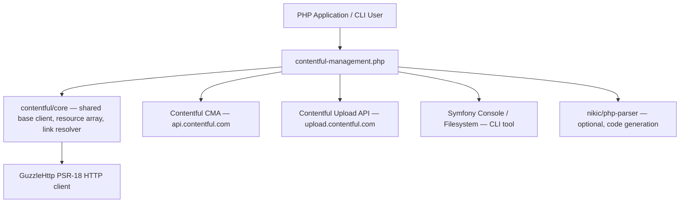

# Architecture

<!-- Generated by seed-golden-context | Last updated: 2026-05-11 -->

## Overview

`contentful-management.php` is a PHP SDK for [Contentful's Content Management API (CMA)](https://www.contentful.com/developers/docs/references/content-management-api/). It is a publish-and-forget open-source library — Contentful ships it to Packagist and the broader PHP community consumes it. The SDK wraps every CMA endpoint as typed PHP objects with full CRUD support, and ships a CLI tool for code generation.

## System Context

**Consumers:** Any PHP application (or framework — Laravel, Symfony, etc.) that needs to manage Contentful content programmatically. Also consumed by Contentful's own internal tools and migration tooling.

## Internal Structure

| Directory / File | Purpose |
|---|---|
| `src/Client.php` | Top-level entry point; extends `contentful/core` `BaseClient`; uses three `ClientExtension` traits for org/space/user APIs |
| `src/ClientExtension/` | Trait-based mixins that add space, org, and user methods to `Client` — keeps the client class size manageable |
| `src/Proxy/SpaceProxy.php` | Lazy reference to a space; avoids repeated space fetches when scoping API calls |
| `src/Proxy/EnvironmentProxy.php` | Lazy reference to an environment; same pattern as SpaceProxy |
| `src/Proxy/Extension/` | Trait extensions for proxy classes (mirrors ClientExtension pattern) |
| `src/Resource/` | One class per CMA resource type (Asset, Entry, ContentType, Role, Webhook, etc.) |
| `src/Resource/Behavior/` | Shared behavior traits: `ArchivableTrait`, `DeletableTrait`, `PublishableTrait`, `UpdatableTrait`, `CreatableInterface` |
| `src/Mapper/` | One mapper per resource — converts raw API JSON arrays into typed Resource objects |
| `src/ResourceBuilder.php` | Extends `BaseResourceBuilder`; dispatches `sys.type` → correct mapper class |
| `src/ApiConfiguration.php` | Central registry: maps each resource class → its CMA URI template, required path parameters, and optional upload host override |
| `src/RequestUriBuilder.php` | Resolves URI templates from `ApiConfiguration` given a set of parameter values |
| `src/LinkResolver.php` | Resolves `Link` objects returned by the API back into concrete resource fetches |
| `src/SystemProperties/` | Typed system-property value objects (`id`, `version`, `createdAt`, etc.) per resource type |
| `src/Exception/` | Domain exceptions extending core exceptions (rate limit, validation failure, etc.) |
| `src/Console/` | Symfony Console `Application` and `GenerateEntryClassesCommand` — ships as `bin/contentful-management` CLI |
| `src/CodeGenerator/` | nikic/php-parser–based code generator that scaffolds typed PHP entry classes from a content type definition |
| `src/Query.php` | Fluent query builder for collection endpoints (limit, skip, ordering, content type filter) |
| `tests/Unit/` | Pure unit tests — no HTTP, no fixtures |
| `tests/Integration/` | Integration tests backed by php-vcr cassette recordings in `tests/Recordings/` |
| `tests/E2E/` | Live end-to-end tests against real Contentful spaces (require credentials) |

## Data Flow

1. **User constructs a resource or calls a `get*` method** on the `Client`, `SpaceProxy`, or `EnvironmentProxy`.
2. **`ApiConfiguration` resolves the URI template** for the target resource class, filling in space/environment/resource IDs.
3. **`BaseClient` (from `contentful/core`) issues the HTTP request** via Guzzle; adds auth header, SDK user-agent, and rate-limit retry logic.
4. **The JSON response is deserialized**: `ResourceBuilder.getSystemType()` reads `data.sys.type` and routes to the correct `Mapper` class, which hydrates a typed `Resource` object.
5. **Resources expose mutation methods** (`update()`, `publish()`, `archive()`, `delete()`) that each call back into `Client` with the resource's own URI and current version header.
6. **Upload flow** diverges at step 3: `Upload` resources are posted to `upload.contentful.com` (configured in `ApiConfiguration` as a `host` override).

## Key Dependencies

| Dependency | Why it's here |
|---|---|
| `contentful/core` ^4.0 | Shared base client, `BaseResourceBuilder`, `ResourceArray`, `Link`, PSR-compliant HTTP abstractions — avoids duplication with the CDA PHP SDK |
| `symfony/console` ^4-7 | Powers the `bin/contentful-management` CLI (`GenerateEntryClassesCommand`) |
| `symfony/filesystem` ^4-7 | File write helpers used in code generation output |
| `phpunit/phpunit` ^9 | Test framework |
| `php-vcr/php-vcr` + `covergenius/phpunit-testlistener-vcr` | Records and replays HTTP cassettes for integration tests — no live credentials needed in CI |
| `nikic/php-parser` ^4 (suggested) | AST-based PHP code generation for the `generate:entry-classes` command |
| `friendsofphp/php-cs-fixer` ^3 | Enforces consistent PHP code style |
| `phpstan/phpstan` ^1.9 | Static analysis at level 5 |
| `roave/backward-compatibility-check` ^7-8 | Detects BC breaks between the previous git tag and HEAD |

## Configuration

The SDK is configured entirely via the `Client` constructor — no environment variables at runtime.

| Option | Purpose | Default |
|---|---|---|
| First constructor arg (string) | CMA access token (Bearer) | Required |
| `max_rate_limit_retries` (array option) | How many times to retry a 429 response before throwing | `0` (no retry) |
| `CONTENTFUL_PHP_MANAGEMENT_SDK_ENV` (env, test only) | Switches HTTP client to VCR mode in test suite | `"test"` in `phpunit.xml.dist` |

## Integration Points

### Upstream (this repo consumes)

- **Contentful CMA** (`https://api.contentful.com`) — all space/org/env/entry/asset/role/webhook management operations
- **Contentful Upload API** (`https://upload.contentful.com`) — binary file uploads (separate host, same auth token)
- **`contentful/core`** — base HTTP client, resource deserialization infrastructure, shared type definitions

### Downstream (consumes this repo)

- **PHP application developers** — install via Composer (`contentful/contentful-management`)
- **`contentful/contentful-laravel`** — Laravel integration package wraps this SDK
- **`contentful/ContentfulBundle`** — Symfony bundle wraps this SDK
- **Contentful internal tooling** — migration and seeding scripts
